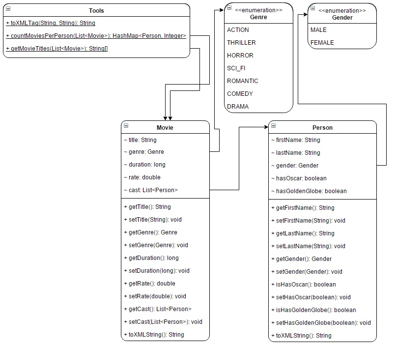

# Week9A_Java
<h3>Here you can find my first Java programs!</h3>

In this repository you can find a <i><b>Java</b></i> program what return with a mini <i><b>XML</b></i> database.  
The <i>XML</i> database contains three famous movie with different data.
These Java files are found in the Movies package.  
A short description about the *.java files:  
- [Movie.java](Movies/Movie.java): this class creates movies with parameters <i>title</i>, <i>genre</i>, <i>duration</i>, <i>rate</i> and <i>cast</i>. The <i>toXMLTag()</i> method returns a string type which contains <i>XML tags</i> to write out into a movies.xml file.  
- [Person.java](Movies/Person.java): this class creates people with parameters <i>firstName</i>, <i>lastName</i>, <i>gender</i>, <i>hasOscar</i> and <i>hasGoldenGlobe</i>. The <i>toXMLTag()</i> method returns a string type which contains <i>XML tags</i> to write out into a movies.xml file.  
- [Tools.java](Movies/Tools.java): this class contains only static methods:
  - <i>countMoviesPerPerson</i> with input of <i>movies</i> and return with a <i>hashmap</i> which shows that in how many movies was an actor playing role.
  - <i>getMovieTitles</i> with input of <i>movies</i> and return with a list of <i>string</i> which shows the title of every movie.
  - <i>toXMLTag</i> with input of <i>tag</i> and <i>value</i> of this and return with a <i>string</i> which has XML from.
- [MovieManager.java](Movies/MovieManager.java): this class contains the <i>main</i> function which write out the data of movies into an XML file.  
  
This is the <i>UML class diagram</i> of this program:  

